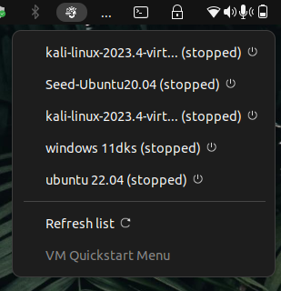
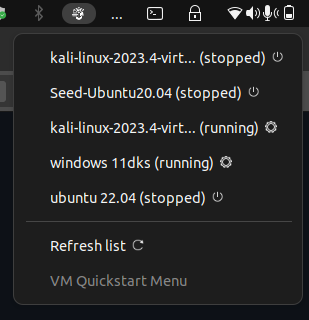

<div align="center">


# 🚀 VM Quickstart


**Instant access to your VirtualBox machines from the GNOME top panel**  
[]() 
[]()

</div>

---

## 🌟 Key Features

✅ **Real-Time Listing** of all VirtualBox VMs  
⚡ **One-Click Launch** directly from system tray  
🔄 Auto-refresh every 30 seconds (configurable)  
🎨 **Visual Status Indicators** (running/stopped)  
📌 **Native Integration** with GNOME Shell  

---

## 🖥️ Screenshots

| Main Menu | VM States |
|-----------|-----------|
|  | 

---


## 📥 Installation

### Recommended Method (GNOME Extensions):
[](https://extensions.gnome.org/extension/XXXX/vm-quickstart/) <!-- Update link -->

### Manual Installation:
```bash
git clone https://github.com/yourusername/VM-Quickstart.git
cd VM-Quickstart
make install  # Requires: glib-compile-schemas, gettext
```

---

## 🛠️ Basic Usage

1. **Open the menu** from top panel icon
2. **View updated list** of all VMs
3. **Click any VM** to launch it
4. Use **🔄 Refresh List** button for manual sync
5. **Indicators** show current status:
   - 🟢 Running VM
   - 🔴 Stopped VM

---

## 🤝 Contributing

We welcome contributions! Please:
1. Fork the repository
2. Create your feature branch (`git checkout -b feature/amazing-feature`)
3. Commit your changes (`git commit -m 'Add some amazing feature'`)
4. Push to the branch (`git push origin feature/amazing-feature`)
5. Open a Pull Request

---

## 📄 License

Distributed under MIT License. See `LICENSE` for more information.

---

**Like the project?** Give it a ⭐ on GitHub and share with other VirtualBox users!

[]() 
```
